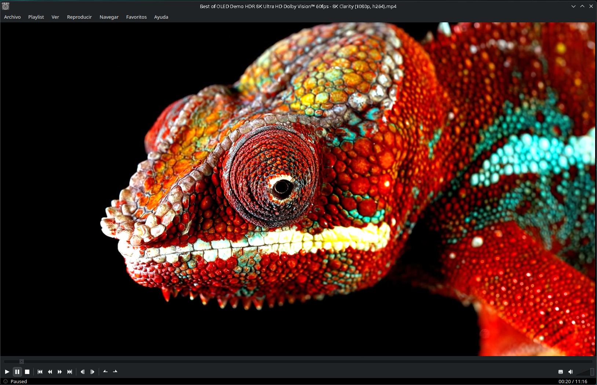
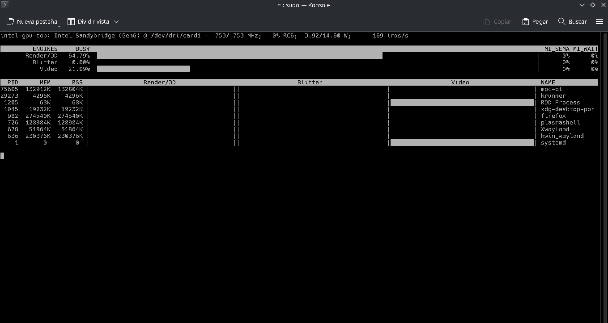

# MPC-Qt AppImage with VA-API (Linux)

This repository contains a lightweight AppImage packaging of MPC-Qt with VA-API hardware video acceleration.

MPC-Qt running with hardware accelerated video playback.

Intel GPU hardware acceleration verified with intel_gpu_top.

About

This repository contains the AppDir structure and custom packaging files used to build the MPC-Qt AppImage.

This project is not the original MPC-Qt source code.

The MPC-Qt application files are obtained from a Linux installation and packaged into an AppImage format.

The purpose of this repository is to maintain:

AppDir structure
AppRun launcher
desktop entry
icons
packaging scripts
build automation
Runtime Requirements

This AppImage is intentionally lightweight.

Multimedia libraries are not bundled inside the AppImage. Instead, it uses the libraries already installed on the Linux system.

Required packages:

Debian / Ubuntu / Linux Mint / Pop!_OS   
    sudo apt install mpv ffmpeg  
        
Arch Linux / EndeavourOS / Manjaro / CachyOS       
    sudo pacman -S mpv ffmpeg    

Fedora / Nobara    
    sudo dnf install mpv ffmpeg    

openSUSE    
    sudo zypper install mpv ffmpeg        

Alpine Linux    
    sudo apk add mpv ffmpeg    
    
Void Linux    
    sudo xbps-install -S mpv ffmpeg

NixOS    
    nix-env -iA nixpkgs.mpv nixpkgs.ffmpeg

Hardware Video Acceleration
For GPU hardware decoding, a working graphics driver with VA-API and/or VDPAU support is required.

Supported acceleration depends on the installed GPU drivers:

Intel GPU → VA-API / Intel Media Driver
AMD GPU → VA-API Mesa drivers
NVIDIA GPU → VDPAU or compatible VA-API translation layer

Verify VA-API:

vainfo

Monitor Intel GPU acceleration:

sudo intel_gpu_top
Building

The repository includes an automated build script.

The script downloads the required files, prepares the AppDir and generates the AppImage automatically.

Manual build:

ARCH=x86_64 ./appimagetool-x86_64.AppImage ./Mpc-qt.AppDir MPC-Qt-VAAPI-x86_64.AppImage
Design Goal

This AppImage was created with a focus on portability and reduced size.

Instead of duplicating large multimedia libraries inside the package, it relies on the optimized FFmpeg/mpv libraries already available in the host system.

This keeps the AppImage lightweight while maintaining compatibility with Linux distributions and allowing hardware video acceleration through VA-API when supported.

License

Packaging files, scripts and configuration files are provided as-is.

MPC-Qt and its dependencies remain under their respective licenses.
